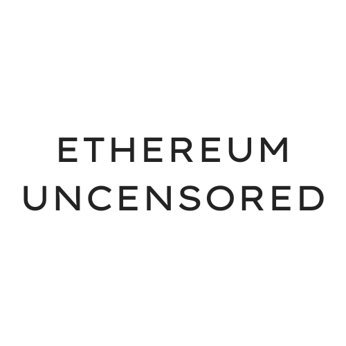

# Uncensored Ethereum

Public good tool for the *Ethereum* Community that informs  when a block may have been intentionally censored and allows the community to take action against these intentional attacks.

Built in *ETHMexico* with React, Next.js, GoLang, and MySQL by ❤️.

Follow us on [Twitter](https://twitter.com/ethereumuncensored)

